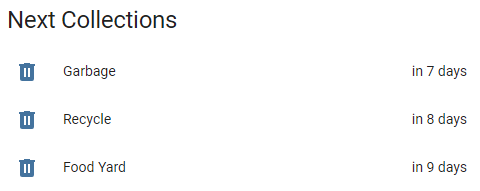
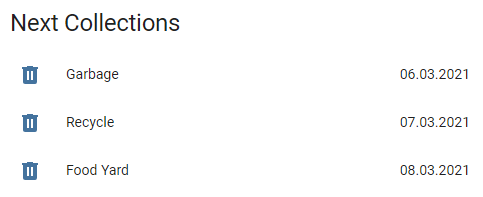
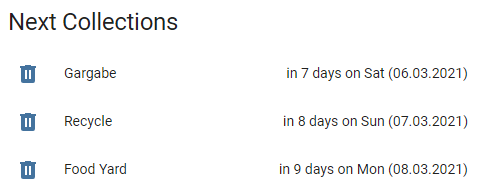
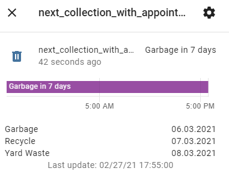

# Waste Collection Schedule

Waste Collection Schedule provides schedules from waste collection service providers to Home Assistant. Additionally, it supports schedules from generic ICS files which can be stored locally or fetched from a web site. There is a high flexibility in providing the information to be displayed.

*For developers:* This framework can be easily enhanced to support further waste collection service providers or other services which provide schedules.

If you like this component, please give it a star on [github](https://github.com/mampfes/hacs_waste_collection_schedule).

## Table of Contents

- [Examples](#examples)
- [Supported Service Providers](#supported-service-providers)
- [Installation](#installation)
- [Configuration](#configuration)
- [FAQ](#faq)
- *For developers*: [How to add new sources](#how-to-add-new-sources)

## Examples

A complete example can be found [here](./doc/configuration.yaml).

Per default (without further configuration), the time to the next collection will be shown in an [entity card](https://www.home-assistant.io/lovelace/entity/):


You can also setup dedicated entities per waste type and show the schedule in various formats:





The information in the more-info popup can be displayed in different formats:

1. List of upcoming collections:

   

2. List of waste types and collection date:

   

[Button Card](https://github.com/custom-cards/button-card) can be used to create individual Lovelace cards:


The collection schedule will be automatically integrated into the Home Assistant calendar:


## Supported Service Providers

Currently the following service providers are supported:

- [Generic ICS / iCal File](./doc/source/ics.md)

### Australia

- [Brisbane City Council](./doc/source/brisbane_qld_gov_au.md)
- [The Hills Council, Sydney](./doc/source/thehills_nsw_gov_au.md)
- [Stonnington City Council, Melbourne](./doc/source/stonnington_vic_gov_au.md)

### Belgium
- [Hygea.be](./doc/source/hygea_be.md)

### Germany

- [Abfall.IO / AbfallPlus.de](./doc/source/abfall_io.md)
- [Abfall_Kreis_Tuebingen.de](./doc/source/abfall_kreis_tuebingen_de.md)
- [AbfallNavi.de (RegioIT.de)](./doc/source/abfallnavi_de.md)
- [Abfallwirtschaft Stuttgart](./doc/source/stuttgart_de.md)
- [Abfallwirtschaft Südholstein](./doc/source/awsh_de.md)
- [Abfallwirtschaft Zollernalbkreis](./doc/source/abfall_zollernalbkreis_de.md)
- [AWBKoeln.de](./doc/source/awbkoeln_de.md)
- [AWIDO-online.de](./doc/source/awido_de.md)
- [Berlin-Recycling.de](./doc/source/berlin_recycling_de.md)
- [BSR.de / Berliner Stadtreinigungsbetriebe](./doc/source/bsr_de.md)
- [Jumomind.de](./doc/source/jumomind_de.md)
- [Landkreis-Wittmund.de](./doc/source/landkreis_wittmund_de.md)
- [Muellmax.de](./doc/source/muellmax_de.md)
- [MyMuell App](./doc/source/jumomind_de.md)
- [Oberhausen.de](./doc/source/oberhausen_de.md)
- [Rhein-Hunsrück Entsorgung (RHE)](./doc/source/rh_entsorgung_de.md)
- [Sector27.de](./doc/source/sector27_de.md)
- [Stadtreinigung.Hamburg](./doc/source/stadtreinigung_hamburg.md)
- [Stadtreinigung-Leipzig.de](./doc/source/stadtreinigung_leipzig_de.md)
- [WAS Wolfsburg](./doc/source/was_wolfsburg_de.md)

### Netherlands

- [Ximmio](./doc/source/ximmio_nl.md)
- [HVCGroep](./doc/source/hvcgroep_nl.md)

### New Zealand

- [Wastenet.org.nz](./doc/source/wastenet_org_nz.md)
- [Aucklandcouncil.govt.nz](./doc/source/aucklandcouncil_govt_nz.md)

### Sweden
- [Lerum.se](./doc/source/lerum_se.md)

### United States of America

- [PGH.ST](./doc/source/pgh_st.md)
- [Seattle Public Utilities](./doc/source/seattle_gov.md)

## Installation

1. Ensure that [HACS](https://github.com/hacs/integration) is installed.
2. Install the "Waste Collection Schedule" integration.
3. [Configure the integration](#configuration).
4. Restart Home Assistant.

In case you would like to install manually:

1. Copy the folder `waste_collection_schedule` to `custom_components` in your Home Assistant `config` folder.
2. [Configure the integration](#configuration).
3. Restart Home Assistant.

## Configuration

The configuration consists of two entries in the file `configuration.yaml`:

1. Source configuration

   For each service provider, a source has to be added to the configuration. The source takes care of the arguments which are required to get the correct information from the service providers' web page, e.g. district, city, street, house number, etc.

   If you have to fetch data from multiple service providers, you have to add multiple sources. You can also add the same service provider multiple times (which only makes sense if you use this with different arguments), e.g. if you are looking for displaying the waste collection schedules for multiple districts.

2. Sensor configuration

   A sensor is used to visualize the retrieved information, e.g. waste type, next collection date or number of days to next collection. The sensor state (which is shown in a Lovelace card) can be customized using templates. As an example, you may display the collection type only or the next collection date or a combination of all available information.

   You can also add multiple sensors per source if you are going to display the information in separate entities like the available collection types or the next collection date.

   If you are looking for displaying one entity per collection type, you just have to add one sensor per collection type.

## 1. Configure the source(s)

```yaml
waste_collection_schedule:
  sources:
    - name: SOURCE
      args:
        SOURCE_SPECIFIC_ARGUMENTS
      customize:
        - type: TYPE
          alias: ALIAS
          show: SHOW
          icon: ICON
          picture: PICTURE
      calendar_title: CALENDAR_TITLE
  fetch_time: FETCH_TIME
  random_fetch_time_offset: RANDOM_FETCH_TIME_OFFSET
  day_switch_time: DAY_SWITCH_TIME
  separator: SEPARATOR
```

### Configuration Variables

**sources**

*(list) (required)*

List of service providers (waste collectors). See [Source Configuration Variables](#source-configuration-variables) for a list of available configuration variables.

**fetch_time**

*(time) (optional, default: ```"01:00"```)*

Time of day when to fetch new data from the source. Data will be fetched once per day.

**random_fetch_time_offset**

*(int) (optional, default: ```60```)*

Random offset to the `fetch_time` in minutes. Used to distribute the fetch commands of all Home Assistant instances over a larger period of time to avoid peak loads at the service providers.

**day_switch_time**

*(time) (optional, default: ```"10:00"```)*

Time of day when today's collection is going to expire and hence will not be displayed anymore.

How it works: If you set the ```day_switch_time``` to 10:00 the sensor will display today's collections until 10:00. After 10:00, today's collections will not be displayed anymore.

**separator**

*(string) (optional, default: ```", "```)*

Used to join entries if there are multiple entries for one day (n/a if value_templates are used).

### Source Configuration Variables

**name**

*(string) (required)*

Name of the source (service provider). Equates to the file name (without ```.py```) of the source. See [Supported Service Providers](#supported-service-providers) for a list of available sources.

**args**

*(dict) (optional)*

Source (service provider) specific arguments, e.g. district, city, street, waste type, etc. See [Supported Service Providers](#supported-service-providers) for details.

**customize**

*(dict) (optional)*

Used to customize the retrieved data from a source (service provider). See [Customize Source](#customize-source) for a list of available configuration variables.

**calendar_title**

*(string) (optional)*

Alternative title for source in Home Assistant calendar.

### Customize Source

Used to customize the retrieved data from a source (service provider).

**type**

*(dict) (required)*

Type of waste as it has been retrieved by the source (service provider).

**alias**

*(string) (optional, default: ```None```)*

Optional, usually better readable name for type of waste to be collected.

**show**

*(boolean) (optional, default: ```True```)*

Show or hide collections with the given waste type.

**icon**

*(string) (optional, default: ```None```)*

Alternative icon for waste type.

**picture**

*(string) (optional, default: ```None```)*

Optional picture for waste type.

## 2. Add sensor(s) to a source

Add the following lines to your `configuration.yaml` file:

```yaml
sensor:
  - platform: waste_collection_schedule
    source_index: SOURCE_INDEX
    name: NAME
    details_format: DETAILS_FORMAT
    count: COUNT
    leadtime: LEADTIME
    value_template: VALUE_TEMPLATE
    date_template: DATE_TEMPLATE
    add_days_to: ADD_DAYS_TO
    types:
      - Waste Type 1
      - Waste Type 2
```

### Configuration Variables

**source_index**

*(integer) (optional, default: ```0```)*

Reference to source (service provider). Used to assign a sensor to a specific source. Only required if you defined more than one source. The first defined source has the source_index 0, the second source 1, ...

**name**

*(string) (required)*

Name of the sensor.

**details_format**

*(string) (optional, default: ```"upcoming"```)*

Used to specify the format of the information displayed in the more-info popup of a Lovelace card.

Possible choices:

- ```upcoming``` shows a list of upcoming collections.

  

- ```appointment_types``` shows a list of waste types and their next collection date.

  

- ```generic``` provides all attributes as generic Python data types. This can be used by a specialized Lovelace card (which doesn't exist so far).<br>
  
  

**count**

*(integer) (optional, default = infinite)*

Used to limit the number of collections displayed in the more-info popup of a Lovelace card by ```count```.

**leadtime**

*(integer) (optional, default = infinite)*

Used to limit the number of collections displayed in the more-info popup of a Lovelace card. Only collections within the next ```leadtime``` days will be displayed.

**value_template**

*(string) (optional)*

Template string used to format the state of an entity.

See [Template Variables](#template-variables) for a list of available variables.

**date_template**

*(string) (optional)*

Template string used to format collection dates within the more-info popup.

See [Template Variables](#template-variables) for a list of available variables.

**add_days_to**

*(boolean) (optional, default: ```False```)*

Adds an attribute with the label `daysTo` and the number of days to the next collection to the entity state of the source.

**types**

*(list of strings) (optional)*

Used to filter waste types. The sensor will only display collections with these type(s).

## Template Variables

The following variables can be used within `value_template` and `date_template`:

Variable | Description | Type | Comments
--|--|--|--
```value.date``` | Collection date | [datetime.date](https://docs.python.org/3/library/datetime.html#datetime.date) | Use [strftime](https://docs.python.org/3/library/datetime.html#strftime-strptime-behavior) to format the output.
```value.daysTo``` | Days to collection | int | 0 = today, 1 = tomorrow, ...
```value.types``` | Waste types | list of strings | Use `join` filter to join types.

## FAQ

### 1. How do I format dates?

Use [strftime](https://docs.python.org/3/library/datetime.html#strftime-strptime-behavior) in `value_template` or `date_template`:

```yaml
# returns "20.03.2020"
value_template: '{{value.date.strftime("%d.%m.%Y")}}'
date_template: '{{value.date.strftime("%d.%m.%Y")}}'

# returns "03/20/2020"
value_template: '{{value.date.strftime("%m/%d/%Y")}}'
date_template: '{{value.date.strftime("%m/%d/%Y")}}'

# returns "Fri, 03/20/2020"
value_template: '{{value.date.strftime("%a, %m/%d/%Y")}}'
date_template: '{{value.date.strftime("%a, %m/%d/%Y")}}'
```

### 2. How do I show the number of days to the next collection?

Set `value_template` within the sensor configuration:

```yaml
value_template: 'in {{value.daysTo}} days'
```

### 3. How do I show *Today* / *Tomorrow* instead of *in 0/1 days*?

Set `value_template` within the sensor configuration:

```yaml
# returns "Today" if value.daysTo == 0
# returns "Tomorrow" if value.daysTo == 1
# returns "in X days" if value.daysTo > 1
value_template: 'TodayTomorrowin {{value.daysTo}} days'
```

### 4. How do I join waste types in a `value_template`?

Use the `join` filter:

```yaml
# returns "Garbage, Recycle"
value_template: '{{value.types|join(", ")}}'

# returns "Garbage+Recycle"
value_template: '{{value.types|join("+")}}'
```

Note: If you don't specify a `value_template`, waste types will be joined using the `separator` configuration variable.

### 5. How do I setup a sensor which shows only the days to the next collection?

Set `value_template` within the sensor configuration:

```yaml
value_template: '{{value.daysTo}}'
```

### 6. How do I setup a sensor which shows only the date of the next collection?

Set `value_template` within the sensor configuration:

```yaml
value_template: '{{value.date.strftime("%m/%d/%Y")}}'
```

### 7. How do I configure a sensor which shows only the waste type of the next collection?

Set `value_template` within the sensor configuration:

```yaml
value_template: '{{value.types|join(", ")}}'
```

### 8. How do I configure a sensor to show only collections of a specific waste type?

Set `types` within the sensor configuration:

```yaml
sensor:
  - platform: waste_collection_schedule
    name: next_garbage_collection
    types:
      - Garbage

  - platform: waste_collection_schedule
    name: next_recycle_collection
    types:
      - Recycle
```

Note: If you have set an alias for a waste type, you must use the alias name.

### 9. How can I rename an waste type?

Set `alias` in the customize section of a source:

```yaml
waste_collection_schedule:
  sources:
    - name: NAME
      customize:
        - type: Very long garbage name
          alias: Garbage
        - type: Very long recycle name
          alias: Recycle
```

### 10. How can I hide inappropriate waste types?

Set `show` configuration variable to *false* in the customize section of a source:

```yaml
waste_collection_schedule:
  sources:
    - name: NAME
      customize:
        - type: Inappropriate Waste Type
          show: false
```

### 11. How do I show a colored Lovelace card depending on the due date?

You can use [Button Card](https://github.com/custom-cards/button-card) to create a colored Lovelace cards:


```yaml
# configuration.yaml
sensor:
  - platform: waste_collection_schedule
    name: MyButtonCardSensor
    value_template: '{{value.types|join(", ")}}|{{value.daysTo}}|{{value.date.strftime("%d.%m.%Y")}}|{{value.date.strftime("%a")}}'
```

```yaml
# button-card configuration
type: 'custom:button-card'
entity: sensor.mybuttoncardsensor
layout: icon_name_state2nd
show_label: true
label: |
  [[[
    var days_to = entity.state.split("|")[1]
    if (days_to == 0)
    { return "Today" }
    else if (days_to == 1)
    { return "Tomorrow" }
    else
    { return "in " + days_to + " days" }
  ]]]
show_name: true
name: |
  [[[
    return entity.state.split("|")[0]
  ]]]
state:
  - color: red
    operator: template
    value: '[[[ return entity.state.split("|")[1] == 0 ]]]'
  - color: orange
    operator: template
    value: '[[[ return entity.state.split("|")[1] == 1 ]]]'
  - value: default
```

### 12. Can I also use the **Garbage Collection Card** instead?

Yes, the [Garbage Collection Card](https://github.com/amaximus/garbage-collection-card) can also be used with *Waste Collection Schedule*:

```yaml
# configuration.yaml
sensor:
  - platform: waste_collection_schedule
    name: garbage_days
    details_format: appointment_types
    value_template: "{{ value.daysTo }}"
    types:
      - Garbage

  - platform: template
    sensors:
      garbage:
        value_template: >
          
            2
          
            {{ states('sensor.garbage_days')|int }}
          
        attribute_templates:
          next_date: "{{ state_attr('sensor.garbage_days', 'Garbage') }}"
          days: "{{ states('sensor.garbage_days')|int }}"
```

```yaml
# garbage-collection-card configuration
entity: sensor.garbage
type: 'custom:garbage-collection-card'
```

### 13. How can I sort waste type specific entities?

Prerequisites: You already have dedicated sensors per waste type and want to show the sensor with the next collection in a Lovelace card.

Add `add_days_to: True` to the configuration of all sensors you want to sort. This will add the attribute `daysTo` which can be used by e.g. [auto-entities](https://github.com/thomasloven/lovelace-auto-entities) to sort entities by day of next collection.


## How to add new sources

1. Create a new source in folder `custom_components/waste_collection_schedule/waste_collection_schedule/source` with the lower case url of your service provider (e.g. `abc_com.py` for `http://www.abc.com`).
2. Don't forget to add test cases (= sample data to query the service api).
3. Run `test_sources.py` script to ensure that your source works.
4. Add documentation in folder `docs/source` and add a link to your new source on `README.md` and `info.md`.

Example for `abc_com.py`:

```py
import datetime
from waste_collection_schedule import Collection


DESCRIPTION = "Example source for abc.com"  # Describe your source
URL = "abc.com"    # Insert url to service homepage
TEST_CASES = { # Insert arguments for test cases using test_sources.py script
    "TestName": {"arg1": 100, "arg2": "street"}
}


class Source:
    def __init__(self, arg1, arg2): # argX correspond to the args dict in the source configuration
        self._arg1 = arg1
        self._arg2 = arg2

    def fetch(self):
        entries = []

        entries.append(
            Collection(
                datetime.datetime(2020, 4, 11),
                "Waste Type",
            )
        )

        return entries
```

See also: [custom_components/waste_collection_schedule/waste_collection_schedule/source/example.py](./custom_components/waste_collection_schedule/waste_collection_schedule/source/example.py)

##Guides
There is an HowTo Video in german: https://youtu.be/MzQgARDvRww
